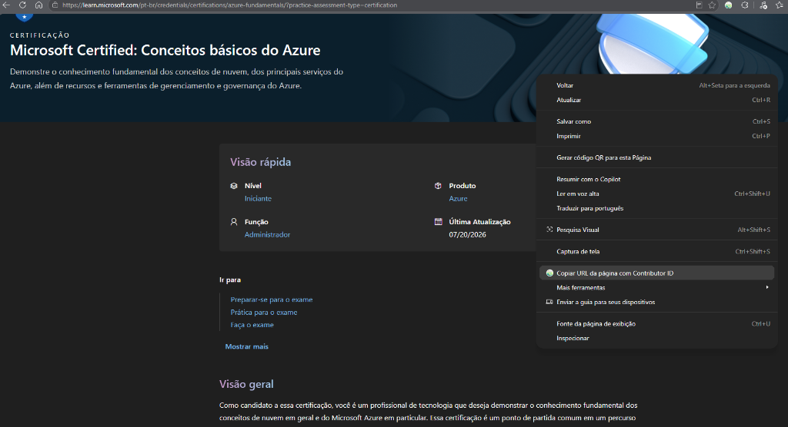

# Ambassador Referral Linker

An independent browser extension for Microsoft Learn Student Ambassadors.

[English](#english) | [Português](#português)

---

## English

Based on the [Skilling Champion Extension](https://github.com/mjisaak/skilling-champion-extension) by Martin Brandl (mjisaak).
Licensed under the MIT License.

This extension allows you to easily copy a link or page URL appending your Microsoft Student Ambassador (MSA) Contributor ID, ensuring your activities and shared links are tracked correctly for your Community Influencer milestones.

It ensures that the Ambassador ID is properly added to the URL (`?wt.mc_id=...` or `&wt.mc_id=...`). It also provides an option to make URLs "language-neutral" (e.g., automatically removing `/en-us/` or `/pt-br/`), enabling Microsoft sites to detect the preferred language of the user who clicks your link.

### How to use

#### 1. Configure your ID
After you have installed the extension, click the extension icon in your browser toolbar to open the popup. Enter your Ambassador ID (e.g. `studentamb_123456`) and click **Save**. You only need to do this once.

You can also check the option to make URLs "language-neutral" to make your links more friendly to a global audience.

#### 2. Copying Links
After you have specified your Ambassador ID, navigate to any eligible Microsoft site. You have two options to create a tracked link:

* **Copy the page URL:** Right-click anywhere on a blank space of the page and select *"Copy page url with Ambassador ID"*.
* **Copy a specific link:** Right-click on a hyperlink inside the page and select *"Copy link address with Ambassador ID"*.

The perfectly formatted link will be copied to your clipboard, ready to be pasted on your social networks!

### Suitable Sites
Currently, the extension operates and injects IDs on the following sites:
* azure.microsoft.com
* blog.fabric.microsoft.com
* code.visualstudio.com
* community.fabric.microsoft.com
* community.powerplatform.com
* copilot.microsoft.com
* devblogs.microsoft.com
* developer.microsoft.com
* dotnet.microsoft.com
* events.microsoft.com
* foundershub.startups.microsoft.com
* imaginecup.microsoft.com
* learn.microsoft.com
* microsoft.com (and subdomains/routes like insidetrack, startups, fabric, cloud, etc)
* mvp.microsoft.com
* powerbi.microsoft.com
* reactor.microsoft.com
* studentambassadors.microsoft.com
* techcommunity.microsoft.com

---

## Português

Baseado na [Skilling Champion Extension](https://github.com/mjisaak/skilling-champion-extension) por Martin Brandl (mjisaak).
Licenciado sob a Licença MIT.

Esta extensão permite que você copie facilmente a URL de uma página anexando o seu Contributor ID do Microsoft Student Ambassador (MSA), garantindo que suas atividades e links compartilhados sejam rastreados corretamente para as suas métricas de Community Influencer.

A extensão garante que o ID seja adicionado corretamente à URL (usando `?wt.mc_id=...` ou `&wt.mc_id=...`). Ela também fornece a opção de tornar as URLs "neutras de idioma" (removendo automaticamente `/pt-br/` ou `/en-us/`), permitindo que os sites da Microsoft detectem o idioma preferido do usuário que clicar no seu link.

### Como usar

#### 1. Configure seu ID
Após instalar a extensão, clique no ícone dela na barra do seu navegador para abrir o menu rápido. Digite o seu Ambassador ID (ex: `studentamb_123456`) e clique em **Salvar**. Você só precisa fazer isso uma vez.

Você também pode marcar a opção para tornar as URLs "neutras de idioma", tornando seus links mais amigáveis para um público global.

#### 2. Copiando Links
Após configurar o seu ID, navegue até qualquer site da Microsoft elegível. Você tem duas opções para gerar um link rastreado:

* **Copiar a URL da página atual:** Clique com o botão direito do mouse em qualquer espaço em branco (vazio) da página e selecione *"Copiar URL da página com Ambassador ID"*.
* **Copiar um link específico:** Clique com o botão direito em cima de um hiperlink dentro da página e selecione *"Copiar endereço do link com Ambassador ID"*.

O link perfeitamente formatado será copiado para a sua área de transferência (clipboard), pronto para ser colado (Ctrl+V) nas suas redes sociais!

### Sites Suportados
Atualmente, a extensão opera nos seguintes sites:
* azure.microsoft.com
* blog.fabric.microsoft.com
* code.visualstudio.com
* community.fabric.microsoft.com
* community.powerplatform.com
* copilot.microsoft.com
* devblogs.microsoft.com
* developer.microsoft.com
* dotnet.microsoft.com
* events.microsoft.com
* foundershub.startups.microsoft.com
* imaginecup.microsoft.com
* learn.microsoft.com
* microsoft.com (e subdomínios/rotas como insidetrack, startups, fabric, cloud, etc)
* mvp.microsoft.com
* powerbi.microsoft.com
* reactor.microsoft.com
* studentambassadors.microsoft.com
* techcommunity.microsoft.com
