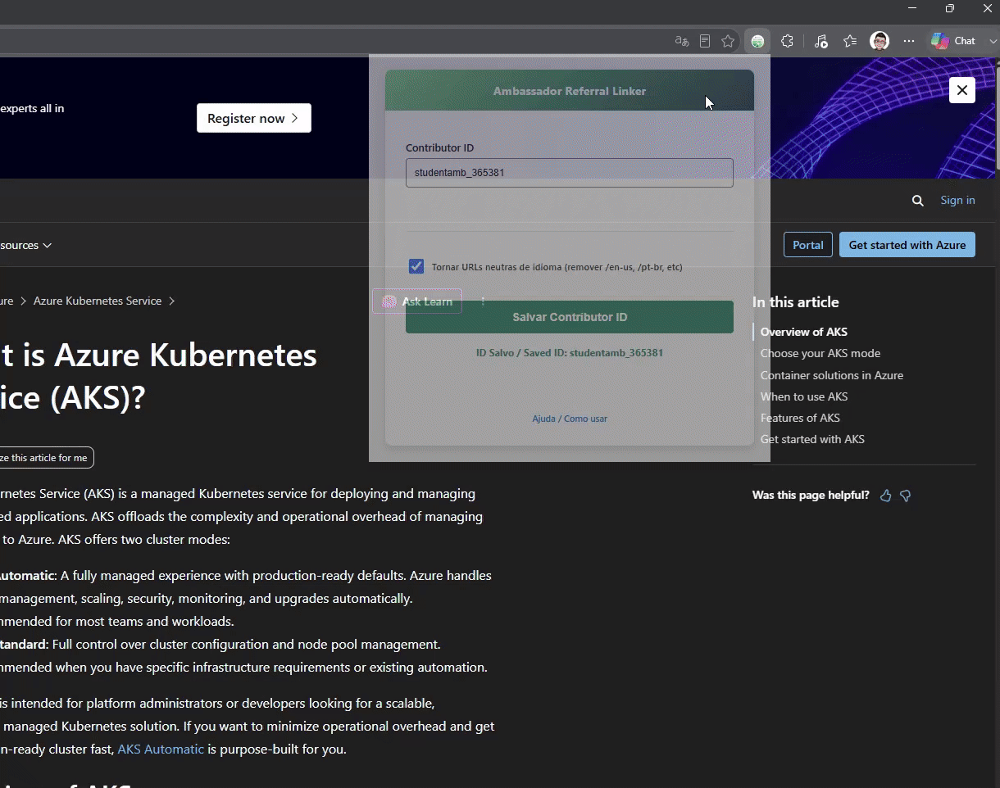

# Ambassador Referral Linker

Uma extensão de navegador independente que adiciona automaticamente o seu Contributor ID de Microsoft Student Ambassador em URLs suportadas da Microsoft.

[Read in English](README.md)

   [](https://github.com/tkusal/ambassador-referral-linker/actions/workflows/ci.yml)



## Por que o Ambassador Referral Linker?

**O Problema:** Os Microsoft Student Ambassadors utilizam o seu Contributor ID único para atribuir atividades elegíveis e conteúdos Microsoft compartilhados aos seus perfis do programa. Limpar manualmente URLs localizadas (como `/pt-br/`), adicionar corretamente o `wt.mc_id` independentemente de a URL já possuir parâmetros de consulta ou não, e ficar copiando e colando o seu ID toda vez é uma tarefa entediante e propensa a erros.

**A Solução:** O Ambassador Referral Linker automatiza esse processo. Com um simples clique com o botão direito em qualquer página ou link suportado da Microsoft, a extensão trata corretamente os parâmetros de consulta, injeta o seu Contributor ID, opcionalmente remove o idioma local, e copia a URL final rastreável diretamente para a sua área de transferência.

**Exemplo:**

```text
https://learn.microsoft.com/en-us/azure/

torna-se:

https://learn.microsoft.com/azure/?wt.mc_id=studentamb_123456
```

## Funcionalidades

- **Cópia com Botão Direito:** Copie rapidamente URLs de páginas ou links específicos com o seu Contributor ID diretamente do menu de contexto do navegador.
- **Substituição de Contributor ID:** Detecta e substitui parâmetros `wt.mc_id` já existentes em vez de criar duplicatas.
- **Tratamento Inteligente de Parâmetros:** Adiciona corretamente o `wt.mc_id` independentemente de a URL já possuir parâmetros de consulta ou não, evitando URLs mal formatadas.
- **Limpeza de Idioma Opcional:** Remove segmentos de idioma (ex: `/pt-br/` ou `/en-us/`) quando a opção de URLs neutras está habilitada.
- **Leve (Lightweight):** Construído com JavaScript puro e Manifest V3, sem dependências de execução (runtime).

## Disponibilidade nos Navegadores

| Navegador | Status                                                                                           |
| :-------- | :----------------------------------------------------------------------------------------------- |
| Chrome    | Em análise                                                                                       |
| Edge      | [Disponível](https://microsoftedge.microsoft.com/addons/detail/nbjblhjldkjffghlpnjlnccjeljehjbh) |
| Firefox   | Planejado                                                                                        |
| Opera     | Em análise                                                                                       |
| Safari    | Planejado                                                                                        |

## Instalação

<a href="https://microsoftedge.microsoft.com/addons/detail/nbjblhjldkjffghlpnjlnccjeljehjbh"></a>

_(O link direto para a Chrome Web Store será adicionado aqui após a publicação.)_

**Instalação Manual (Modo Desenvolvedor):**

1. Baixe este repositório como um arquivo ZIP (ou faça um clone) e extraia-o.
2. No Chrome: Acesse `chrome://extensions/`. No Edge: Acesse `edge://extensions/`.
3. Ative o **Modo do desenvolvedor** (Developer mode).
4. Clique em **Carregar sem compactação** (Load unpacked) e selecione a pasta `src` localizada dentro do diretório extraído.

## Configuração & Como Usar

Por favor, consulte o [Guia de Uso (USAGE.md)](USAGE.md) para obter instruções detalhadas passo a passo, com imagens, sobre como configurar seu ID e utilizar a extensão.

## URLs Neutras de Idioma (Language-Neutral)

Ao compartilhar links da Microsoft globalmente, os segmentos de idioma na URL (como `/pt-br/` ou `/en-us/`) podem direcionar os visitantes para uma versão localizada específica do conteúdo.
Quando a opção **"Tornar URLs neutras de idioma"** está habilitada, a extensão remove esses segmentos de idioma das URLs copiadas. Assim, os sites da Microsoft podem servir o conteúdo de acordo com o idioma preferido do visitante (quando suportado), proporcionando uma experiência mais adequada para públicos internacionais.

## Sites Suportados

A extensão atualmente suporta os seguintes sites da Microsoft:

- azure.microsoft.com
- blog.fabric.microsoft.com
- code.visualstudio.com
- community.fabric.microsoft.com
- community.powerplatform.com
- copilot.microsoft.com
- devblogs.microsoft.com
- developer.microsoft.com
- dotnet.microsoft.com
- events.microsoft.com
- foundershub.startups.microsoft.com
- imaginecup.microsoft.com
- learn.microsoft.com
- microsoft.com (e subdomínios/rotas como insidetrack, startups, fabric, cloud, etc)
- mvp.microsoft.com
- powerbi.microsoft.com
- reactor.microsoft.com
- studentambassadors.microsoft.com
- techcommunity.microsoft.com

Sentindo falta de um site da Microsoft que deveria ser suportado? Por favor, abra uma _issue_ ou envie um _pull request_.

## Privacidade

O Ambassador Referral Linker não coleta histórico de navegação, analytics, informações pessoais ou o conteúdo das páginas acessadas.

Seu Contributor ID e suas preferências são armazenados utilizando `chrome.storage.sync`, o mecanismo de armazenamento fornecido pelo próprio navegador. Dependendo das configurações de sincronização da sua conta no navegador, essas informações podem ser sincronizadas entre seus dispositivos.

A extensão não envia seus dados para servidores controlados pelo projeto ou pelo mantenedor.

## Permissões

A extensão solicita apenas as permissões necessárias para o seu funcionamento:

- `contextMenus`: adiciona as opções da extensão ao menu de contexto do navegador.
- `storage`: armazena seu Contributor ID e suas preferências.
- `clipboardWrite`: permite copiar a URL gerada para a área de transferência.
- `offscreen`: permite utilizar um documento offscreen para realizar a operação de cópia exigida pelo Manifest V3.

## Compatibilidade

Oficialmente testado no Google Chrome e Microsoft Edge. Outros navegadores baseados em Chromium com suporte ao Manifest V3 também podem funcionar.

## Desenvolvimento e Contribuições

Contribuições são bem-vindas!

Consulte o [CONTRIBUTING.md](CONTRIBUTING.md) para obter instruções sobre configuração do ambiente de desenvolvimento, testes, envio de pull requests e diretrizes de contribuição.

O projeto oferece formulários de issues em **inglês e português do Brasil** para:

- Relatar bugs
- Sugerir novas funcionalidades

[Relatar um bug ou sugerir uma funcionalidade](https://github.com/tkusal/ambassador-referral-linker/issues/new/choose)

Antes de contribuir, leia também o nosso [Código de Conduta](CODE_OF_CONDUCT.md).

### Executando os testes

```bash
npm ci
npm test
```

## Estrutura do Projeto

- `/src`: Código fonte da extensão, incluindo a interface, lógica em background e utilitários de URL.
- `/manifests`: Arquivos manifest específicos para cada navegador.
- `/scripts`: Scripts de compilação (build) para gerar as extensões.
- `/dist`: Saída de build gerada automaticamente para cada navegador.
- `/src/_locales`: Arquivos de internacionalização (i18n) para Inglês e Português.
- `/tests`: Testes automatizados para a lógica de transformação de URL.
- `/assets`: Imagens e mídia utilizadas na documentação.
- `package.json`: Configurações de desenvolvimento e testes.

## Roadmap

- [x] Migrar para Manifest V3
- [x] Atualizar tratamento de URL para o fluxo atual do Contributor ID
- [x] Reformulação de UI/UX e fluxo de Contributor ID único
- [x] Refatorar manipulação de URL em utilitários testáveis
- [x] Adicionar testes automatizados de transformação de URL
- [ ] Publicar na Chrome Web Store (Em análise)
- [x] Publicar nos Complementos do Microsoft Edge
- [x] Reorganizar repositório para suportar múltiplos navegadores
- [ ] Tornar a extensão compatível com o Firefox (adaptar a API offscreen e background scripts)
- [ ] Publicar nos Complementos do Firefox
- [ ] Publicar nos Complementos do Opera (Em análise)
- [ ] Publicar no Safari

## Créditos

Este projeto é uma continuação independente e refatoração substancial baseada na extensão original [Skilling Champion Extension](https://github.com/mjisaak/skilling-champion-extension) criada por Martin Brandl (mjisaak).

## Aviso de Isenção (Disclaimer)

O Ambassador Referral Linker é um projeto open source independente e não é afiliado, endossado ou mantido pela Microsoft ou pelo programa Microsoft Learn Student Ambassadors.

## Licença

Este projeto é open-source e licenciado sob a Licença MIT. Veja [LICENSE](LICENSE) para mais detalhes.
